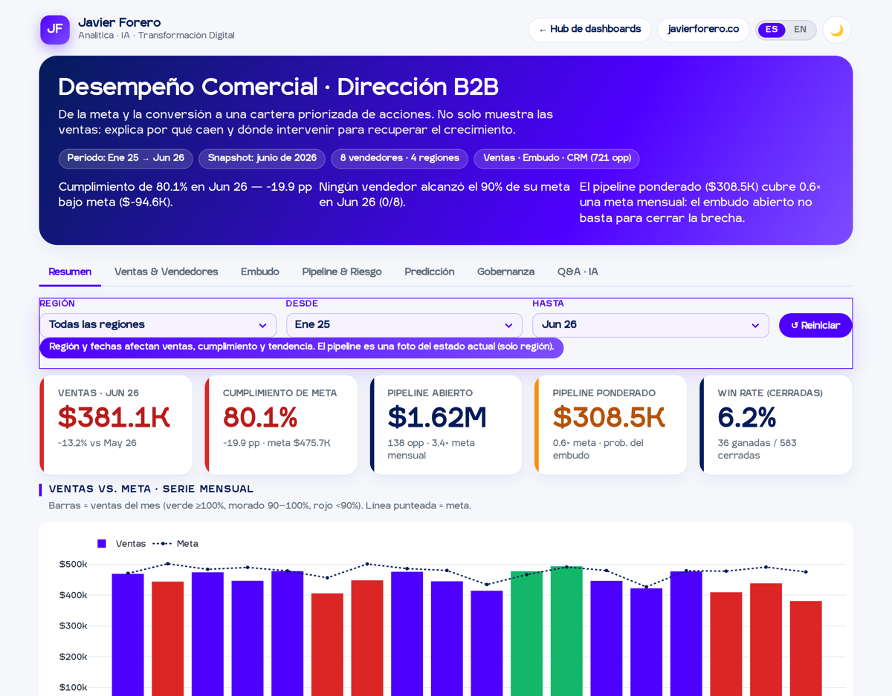

**Español** · [English](README.en.md)

# Desempeño Comercial · Dashboard de Dirección B2B

La pregunta que responde no es *“¿cuánto vendimos?”* sino **“¿por qué no llegamos a la meta y dónde intervengo?”**. Convierte ventas, embudo y CRM en una cartera priorizada de acciones.

> **Nota:** los datos son de demostración (ventas, embudo y CRM simulados). No representan clientes ni operaciones reales.

## El hallazgo que monitorea
Junio 2026 es el peor mes del histórico: **$381,1K de ventas, 80,1% de cumplimiento, −13,2% frente a mayo** y **0 de 8 vendedores** por encima del 90% de su cuota. No es un tropiezo aislado: el cumplimiento agregado pasó de 96,3% a 90,9% entre semestres. El tablero no se queda en la cifra — señala dónde está la fuga.

## El diagnóstico que aporta valor
El pipeline abierto luce holgado (**$1,62M, 3,4× la meta mensual**), pero ponderado por la **probabilidad empírica de cierre de cada etapa** apenas vale **$308,5K — 0,6× una meta**. Esa diferencia cambia la decisión: con un win rate del 6,2%, el reflejo de “meter más leads” es caro e ineficaz.

El cuello de botella está localizado: **Propuesta** es la única etapa que se deteriora (−5,4 pp entre el primer y el último semestre). Recuperar 5 pp ahí multiplica el cierre sin tocar el tope del embudo.

**Coherencia entre sistemas.** La conversión compuesta del embudo (0,45 × 0,55 × 0,46 × 0,55 ≈ 6,3%) coincide con el win rate observado en el CRM (6,2%). Dos fuentes independientes contando la misma historia: de cada 100 prospectos, unos 6 cierran.

## Decisiones de diseño (mi criterio, explícito)
Porque *la analítica no falla por falta de modelos, falla por falta de criterio*:
- **Pipeline ponderado por probabilidades empíricas del propio embudo**, no por pesos arbitrarios. Es más conservador y defendible ante un comité que preguntará de dónde sale cada porcentaje.
- **El embudo no se filtra por región.** La serie mensual del embudo no tiene esa dimensión, así que el filtro se oculta en esa pestaña en vez de ofrecer un control que mentiría.
- **El pipeline no se filtra por fechas.** Es una foto del estado actual de las oportunidades abiertas, no una serie temporal.
- **Predicción con backtest honesto.** Holt con parámetros ajustados por validación; se declara el MAPE frente al modelo ingenuo y se advierte que con 18 meses no hay dos ciclos anuales, así que **no se modela estacionalidad**.
- **Q&A determinista.** Las respuestas se calculan sobre los datos, sin generación de texto libre: cero riesgo de alucinación.
- **Gobernanza con filtro de rigor.** Antes de llevar esto a comité, el tablero lista qué validar: efecto calendario, definición real de “oportunidad” en el CRM y el costo de oportunidad del plan por cuenta.

## Estructura del tablero
Siete pestañas: **Resumen · Ventas & Vendedores · Embudo · Pipeline & Riesgo · Predicción · Gobernanza · Q&A · IA**, con filtros contextuales que solo aparecen donde los datos los soportan.

## Uso
- **Web:** `index.html` (Plotly vía CDN, con respaldo multi-CDN).
- **Offline:** abre `dashboard-offline.html` con doble clic, sin internet. Lleva Plotly embebido y excluye la analítica a propósito.
- **Datos:** en `data/`. Van embebidos en el HTML; los CSV se publican para transparencia y auditoría.

| Archivo | Contenido |
|---|---|
| `ventas_vendedor_mensual.csv` | 144 filas · 8 vendedores × 18 meses: meta, ventas, cumplimiento y oportunidades ganadas |
| `funnel_conversion_mensual.csv` | 89 filas · 5 etapas × 18 meses: oportunidades, avanzaron y tasa de conversión |
| `pipeline_crm_demo.csv` | 721 oportunidades: cliente, industria, región, origen del lead, vendedor, etapa, valor, estado y días de ciclo |
| `diccionario_datos_comercial.csv` | Definición de cada campo |

## Tecnología
HTML + CSS + JavaScript vanilla, sin build. [Plotly.js](https://plotly.com/javascript/) 2.35.2. El motor de predicción (Holt con búsqueda de parámetros y backtest) y el Q&A determinista están implementados desde cero, para que el tablero siga siendo un único archivo autónomo.

El sistema bilingüe usa un mapa único ES→EN donde el español es la clave. El selector escribe `jf-lang` en `localStorage` y refleja el idioma en la URL (`?lang=en`).

---
**Javier Forero** · [javierforero.co](https://javierforero.co) · [LinkedIn](https://www.linkedin.com/in/jforero/)
