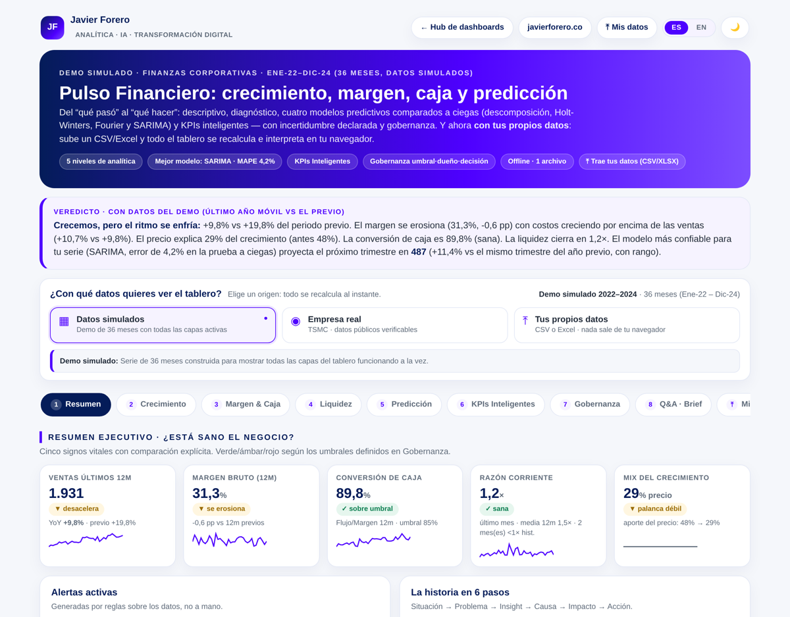

[Español](README.md) · **English**

# Financial Pulse · Corporate Finance Dashboard

The question this answers isn't *“how much did we sell?”* but **“is the business healthy, and what do I decide about it?”** From descriptive to cognitive, with uncertainty stated and the decision governed.

> **Note:** the demo uses simulated data. The dashboard also ships a **verifiable real case** (TSMC) and accepts **your own data**, processed only in your browser.

## Three data sources, one engine

| Source | What it is | What it's for |
|---|---|---|
| **Simulated data** | 36 months built to activate every layer | Seeing the full dashboard at work |
| **Real company** | TSMC (TWSE 2330 · NYSE TSM), Jul-2023 → Jun-2026 | Credibility: official monthly revenue and reported quarterly gross margin, with auditable sources |
| **Your own data** | CSV or Excel, monthly or quarterly | Your reality, with no data leaving your machine |

The switcher sits in the header, visible the moment the page opens. Changing source recalculates the verdict, KPIs, alerts, all four models and the brief.

## Four models compared blind

There is no model that is good for every series: there is **the one that gets it least wrong on yours**. So the dashboard doesn't fix one — it compares them:

| Model | What it assumes | When it wins |
|---|---|---|
| **Decomposition** | Linear trend + a stable seasonal index | Clean trend and regular seasonality |
| **Holt-Winters** | Adaptive level, trend and seasonality | When the business changes pace |
| **Seasonal regression (Fourier)** | The annual cycle as a sum of harmonics; K by AICc | Short or noisy history |
| **SARIMA (p,1,q)(P,1,Q)ₘ** | Memory left in the errors after differencing | Series with inertia and carry-over |

**Protocol.** Each model is retrained at several splits in time (**rolling origin**) and forecasts the following periods blind. The errors —**MAPE, MAE and RMSE**— are averaged and contrasted against a **seasonal naïve method** (repeating the same period last year). A model that cannot beat that benchmark adds no value, and the dashboard says so plainly.

**Stated limitation.** With short histories every selection criterion is noisy: if two models sit within ~0.5 MAPE points, the difference may not be real. The min-max range across splits makes that fragility visible.

**Auditability.** Every model shows its mathematical formulation and every metric its formula, with the corresponding pitfall stated (MAPE blows up near zero; RMSE is sensitive to outliers).

## Design decisions (my judgement, made explicit)
- **Forecast any metric, not only revenue.** You can project margin, cash, units, price or the current ratio; all four models are retrained on the chosen series. In the demo each metric picks a different winner — using the model that is optimal for revenue to project cash would be a mistake.
- **Monthly and quarterly.** The dashboard detects the frequency and **reconfigures the whole seasonal machinery** (period 12 or 4): moving averages, the Holt-Winters cycle, Fourier harmonics and the SARIMA lags.
- **Approximate bands, and said so.** The 80% band uses the standard deviation of the fit residuals; it does not include parameter uncertainty and does not widen with the horizon.
- **Smart KPIs computed, not requested.** The trend and price factors are derived from your own data; no AI columns need to be supplied.
- **Zero hallucination.** No figure is invented: whatever the file doesn't support disables its layer and is declared.

## Bring your own data

The contract is minimal: **the period in the first column**, then whatever metrics you like.

| Column | Format | Use |
|---|---|---|
| Period (1st column) | `YYYY-MM` monthly · `YYYY-QX` quarterly | Required — detected by position, whatever it is called |
| Revenue | number | Required (accepts Revenue, Sales, Ingresos, Ventas…) |
| Costs **or** Margin | number | Required (whichever is missing is derived) |
| CashFlow · Units · Price · Current Assets and Liabilities | number | Optional — each one enables its layer |

You don't need year, month or month-name columns. On validation, the dashboard reports which columns it recognised and which it ignored.

**Take the results with you.** Since nothing is stored on a server, the dashboard exports to **Excel (5 sheets: Summary, Forecast, Models, Series and Methodology)** or CSV, including the forecast from all four models and the formulas.

## Demonstration cases
Four datasets ready to load in `casos/`, each with a different story: a warning, a turnaround, a real monthly case (TSMC) and a real quarterly case (Apple). See [`casos/README.en.md`](casos/README.en.md).

## Usage
- **Web:** `index.html` (Plotly and SheetJS via CDN, with multi-CDN fallback).
- **Offline:** open `dashboard-offline.html` by double-clicking, no internet needed. It carries Plotly and SheetJS embedded —so you can upload your Excel offline— and excludes analytics on purpose.
- **Data:** `data/demo_finanzas.csv` (the 36 demo months). It is embedded in the HTML; the CSV is published for transparency and as a reference template.

## Technology
Vanilla HTML + CSS + JavaScript, no build step. [Plotly.js](https://plotly.com/javascript/) 2.35.2 and [SheetJS](https://sheetjs.com/) 0.18.5. The four models are implemented from scratch in JavaScript —including the Fourier least-squares fit and SARIMA estimation by conditional sum of squares— so the dashboard remains a single self-contained file.

The bilingual system uses a single ES→EN map with Spanish as the key. The switcher writes `jf-lang` to `localStorage` and reflects the language in the URL (`?lang=en`).

---
**Javier Forero** · [javierforero.co](https://javierforero.co) · [LinkedIn](https://www.linkedin.com/in/jforero/)
