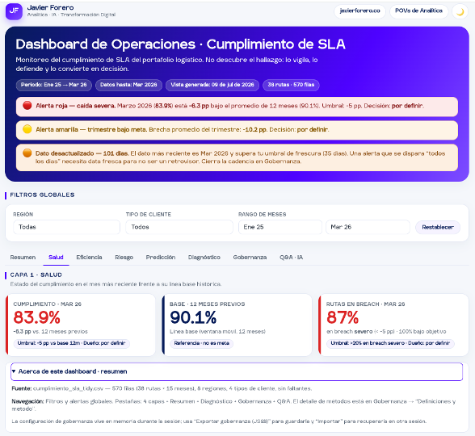

# Cumplimiento de SLA · Dashboard de Operaciones

Construí este tablero para responder una pregunta que veo repetirse en operaciones: **el SLA cayó — ¿y ahora qué hago con eso?** La mayoría de los dashboards se quedan en el gráfico. Este llega hasta la decisión.

Es la pieza práctica del ejercicio *“Métricas y eficiencia operativa”* de mi método, y demuestra en vivo mi marco de los [5 niveles de la analítica](https://javierforero.co/2026/01/26/analitica-datos-5-niveles/): describe, diagnostica, predice, prescribe y conversa.

> **Nota:** los datos son sintéticos (ejemplo de clase). No representan clientes ni operaciones reales.

<!-- Sugerencia: agrega una captura o GIF y descoméntalo:

-->

## El hallazgo que monitorea
El cumplimiento del portafolio cae de **~91% (2025) a ~84% en Q1 2026 (−7 pp)**, con un **quiebre abrupto en enero 2026** (−9 pp de un mes a otro) que golpea a las 8 regiones y a los 4 tipos de cliente casi por igual. Esa uniformidad apunta a una causa **sistémica** —o a un cambio de medición—, no a una ruta suelta. El tablero no re-descubre esa cifra: la vigila, la defiende y la convierte en decisión.

## Qué hace distinto a este dashboard
- **Interpreta, no solo grafica** (Smart Narratives generadas desde los datos).
- **Diagnostica el quiebre** con hipótesis de causa y un veredicto que **bloquea el escalamiento** hasta cerrar la causa (mi filtro de Consecuencias).
- **Gobierna la decisión:** cada indicador lleva **umbral · dueño · decisión**. Un KPI sin dueño no entra al tablero.
- **Conversa con los datos** (pestaña Q&A): lenguaje natural, respuesta anclada a las cifras, sin alucinación.
- **Cierra en un brief** DATA → IDEA → DECISIÓN, exportable solo tras la validación humana.
- **Marca propia** (IgraSans, paleta, tema claro/oscuro) y **funciona offline**.

## Decisiones de diseño (mi criterio, explícito)
Porque *la analítica no falla por falta de modelos, falla por falta de criterio*:
- **Métrica de breach = brecha < −5 pp**, no < 0. Con < 0 el KPI marca 100% (todo bajo meta): una señal plana e inútil. El −5 pp es lo accionable.
- **Sin métricas inventadas.** Lo que el dataset no soporta se marca como pendiente; no se fabrica.
- **La proyección es frágil a propósito.** Solo hay 3 puntos post-quiebre; la marco como tendencia, no como promesa.
- **Frescura visible.** El dato llega a Mar 2026: el tablero avisa cuándo una alerta “diaria” corre sobre dato viejo.

## Uso
- **Offline:** abre `dashboard-offline.html` (doble clic, sin internet).
- **Web:** `index.html` (Plotly vía CDN).
- Datos en `data/` (embebidos en el HTML; el CSV va solo para transparencia).

## Tecnología
HTML + CSS + JavaScript vanilla, sin build. [Plotly.js](https://plotly.com/javascript/) 2.35.2. El Q&A usa un motor local determinista; el *upgrade* generativo requiere backend, así que en GitHub Pages responde el motor local.

---
**Javier Forero** · [javierforero.co](https://javierforero.co) · [LinkedIn](https://www.linkedin.com/in/jforero/)
