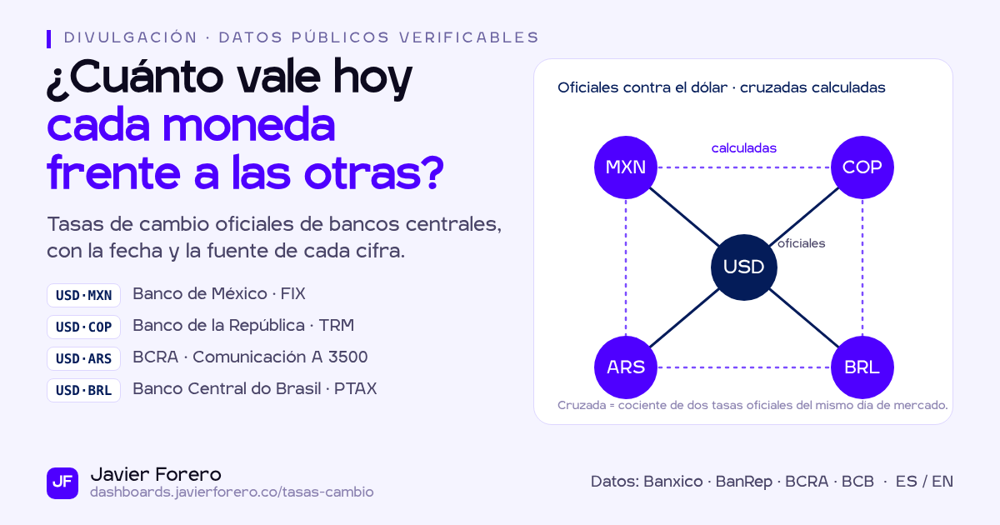

**Español** · [English](README.en.md)

# Tasas de cambio oficiales · México, Colombia y Argentina

La pregunta que responde: **¿cuánto vale hoy cada moneda frente a las otras y qué tan lejos está de su comportamiento reciente?** Está pensada para quien convierte o factura entre México, Colombia y Argentina.

> **Datos reales.** Son tasas oficiales de Banco de México, la Superintendencia Financiera de Colombia y el BCRA, leídas en vivo desde [`jaforero/fx-bancos-centrales`](https://github.com/jaforero/fx-bancos-centrales). Son tasas de referencia, no de transacción: un banco o una casa de cambio aplicará su propio margen. No constituyen asesoría financiera.

## Qué muestra
1. **Hoy.** Una tarjeta por cada serie marcada `primary` en el contrato de datos. Cada tarjeta trae el valor con su unidad (`quote_unit`), su propia fecha, la variación frente al registro oficial anterior, el estado de la fuente y la fuente citada. Las cruzadas se rotulan *calculadas*.
2. **Histórico.** Selector de par; rangos 1M · 3M · 1A · 5A · Todo; escala logarítmica activable. Los fines de semana y festivos se dibujan punteados y cuatro eventos aparecen anotados con su variación calculada sobre los datos.
3. **Base 100.** Las series oficiales contra el dólar parten de 100 desde la fecha elegida, para comparar cuál moneda se depreció más sin el problema de escalas distintas.
4. **Variaciones.** Frente al registro anterior, a 30 días y en lo que va del año, siempre solo con valores oficiales.
5. **Conversor.** Entre las monedas que aparecen en los pares. Indica la fecha de la tasa usada y si es oficial o calculada.
6. **Metodología y fuentes.** Fuentes, metodología de las cruzadas, cómo leer las tasas, la fuente de cada serie y el aviso legal.

## Decisiones de diseño
- **Sin servidor y sin copia de los datos.** La página lee `latest.json` y `rates_daily.json` directamente del repositorio de datos: `raw.githubusercontent.com` es el origen principal y `cdn.jsdelivr.net` el respaldo. Cada visita hace dos peticiones de datos con la cuota de cada visitante.
- **Primero los KPIs.** `latest.json` (unos 6 KB) pinta las tarjetas y `rates_daily.json` carga después. Plotly (paquete *cartesian*, un tercio del tamaño del completo) se descarga solo cuando el lector se acerca a los gráficos: quien solo consulta las tarjetas no paga la librería.
- **Ninguna cifra escrita a mano.** Valores, fechas, variaciones, eventos y textos de lectura salen de los JSON. Las únicas listas fijas son los nombres bilingües por id de serie (`SERIES_TR`) y la fecha y la serie de los cuatro eventos.
- **Un país nuevo aparece solo.** Las tarjetas, el selector, la base 100, la tabla y el conversor se construyen con `primarySeriesIds()` y el campo `pair`. La escala log por defecto se decide con los datos (rango histórico ≥ 3×); hoy coincide exactamente con los pares que incluyen ARS.
- **Tasas con un decimal.** Las cifras de tasas se muestran con un solo decimal para facilitar la lectura. El valor oficial con todos sus decimales aparece en el tooltip de cada cifra y es el que usan el conversor y todas las variaciones.
- **Nunca ocultar un dato.** Una serie con error muestra su último valor con un aviso rojo, y las cruzadas que dependen de ella también quedan marcadas.

## Estados
| Situación | Qué muestra |
|---|---|
| Una serie atrasada (`stale`) | Valor con aviso ámbar «Sin publicación desde {fecha}» |
| Una serie con error (`error:*`) | Último valor con aviso rojo «Fuente no disponible» (detalle técnico en el tooltip); las cruzadas dependientes también se marcan |
| Origen principal caído | Carga desde jsDelivr; el pie indica el origen |
| Sin red | Último dato guardado en el navegador con el aviso «Mostrando datos guardados del {fecha}» |
| Contrato distinto de `schema_version` 1.x | Se rechaza; caché con aviso y evento GA4 `fx_contract_error` |
| `rates_daily.json` falla | Las tarjetas siguen visibles; los gráficos muestran un mensaje y un botón Reintentar |

## Archivos
| Archivo | Rol |
|---|---|
| `index.html` | La página: HTML, CSS y JS en un solo archivo |
| `fx-data.js` | Capa de datos sin dependencias: red con timeout y respaldo, validación del contrato, caché y utilidades de fechas y formato |
| `assets/og-image.png` | Imagen social 1200×630 |

## Fuentes
Banco de México (SIE, tipo de cambio FIX) · Superintendencia Financiera de Colombia vía datos.gov.co (TRM) · Banco Central de la República Argentina (API Estadísticas Cambiarias, Comunicación A 3500). Datos procesados en [`github.com/jaforero/fx-bancos-centrales`](https://github.com/jaforero/fx-bancos-centrales).

Las tasas MXN-COP, MXN-ARS y ARS-COP no las publica ningún banco central: se calculan dividiendo dos tasas oficiales contra el dólar formadas el mismo día de mercado.

## Analítica
GA4 `G-MQ3K8EVKV0` con `content_group: 'tasas-cambio'`. Eventos: `fx_pair_select`, `fx_range_select`, `fx_convert`, `fx_load_error`, `fx_contract_error`, `lang_switch` y `theme_switch`.

## Uso
Abre `https://dashboards.javierforero.co/tasas-cambio/` (`?lang=en` para inglés). El idioma (`jf-lang`) y el tema claro u oscuro (`jf-theme`) se comparten con el resto del portafolio.
